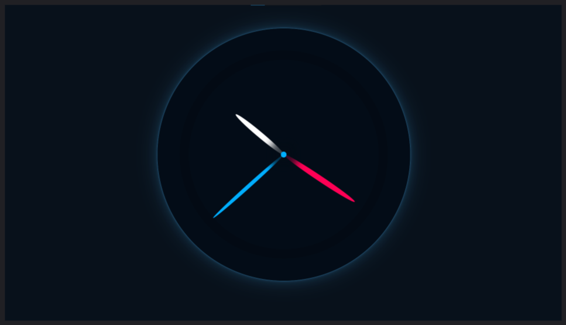

# 🕒 Analog Clock – JS30 Day 2 Challenge

This project is my implementation of **Day 2: JS + CSS Clock** from [Wes Bos’s JavaScript 30 Days Challenge](https://javascript30.com/).
I built **two versions**:

* **Version 1 (Tutorial-based):**
  Based on the default design shown in the challenge. I tweaked the styling a bit because the original wasn’t looking great to me.

  

* **Version 2 (My Own Design):**
  Created completely from scratch to strengthen my understanding of the concepts used in the challenge.
  Added:

  * A new, modern design
  * Responsive layout
  * Clock tick audio

  

---

### 📝 What I Learned

* **`transform-origin`**: How it works and how crucial it is for rotating elements like clock hands.
* **Positioning & Layering:** How `position`, `z-index`, and the `top` / `right` / `bottom` / `left` properties work together to stack and align elements correctly.
* **Using the `Date` object:** Fetching and converting real-time data (hours, minutes, seconds) into angles for rotation.
* **Small UI/UX improvements:** Making hands of different lengths stay perfectly centered and aligned; experimenting with audio for interactivity.

---

### 🛠️ Tech Stack

* HTML
* CSS
* JavaScript

---

### 🚀 How to Run

1. Clone the repo.
2. Open `index.html` for the basic tutorial design and `myDesign.html` for my design - in your browser.
3. Click anywhere on the page (to enable audio playback, due to browser autoplay policies).
