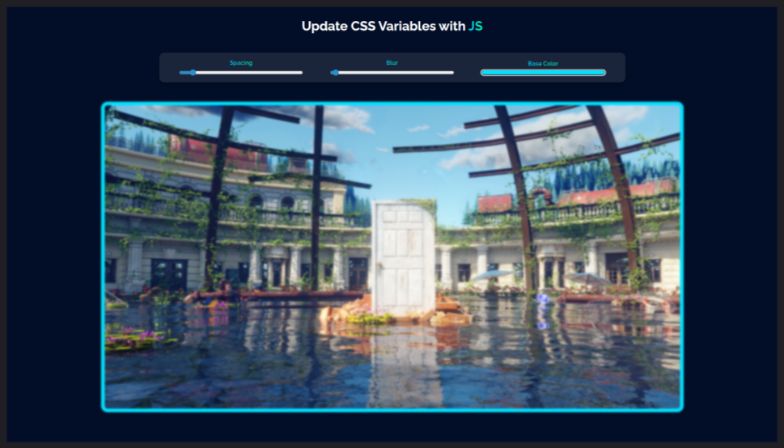
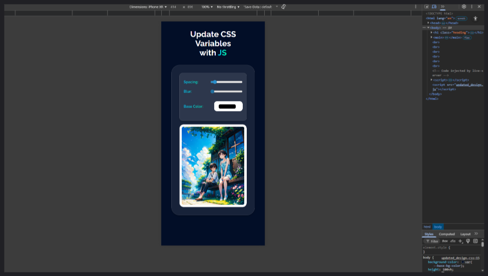

## 🎨 Challenge 3: CSS Variables and JS Manipulation

### 📌 What I Built

An interactive project where I learned to **manipulate CSS variables dynamically using JavaScript**. The project allows live changes to styles like spacing, blur, and color — showing how CSS variables and JS can work together in real time.

---

### 🛠️ My Process

I approached this challenge in **two phases**:

1. **Learning Phase (with tutorial reference)**

   * Followed along with Wes Bos’s tutorial to understand how CSS variables work.
   * Applied the concepts to my own design, making it look better than the tutorial version.

   

2. **Independent Build Phase (from scratch)**

   * Rebuilt the entire project **without looking at the tutorial**, relying only on what I had learned.
   * Focused on improving **design responsiveness** and creating a cleaner layout.
   * Pushed myself to apply concepts independently — no hand-holding.

   
   

---

### 💡 Key Learnings

* **CSS Variables (`--variableName`)**

  * How to declare and use them in global and local scopes.

* **Manipulating Variables with JavaScript**

* **Styling Input Types in CSS**

  * Learned that input elements (like `range`, `color`, etc.) are divided into **different webkit parts**.
  * To style them properly, I need to target those pseudo-elements (like `::-webkit-slider-thumb`).
  * I’m still a beginner here, but I now understand the direction for pro-level custom input styling.

---

### 🚀 Improvements Over Tutorial

* My design is **more visually polished** compared to the original.
* Added **better responsiveness** so it adapts well on different screens.
* Treated the second build as a test where I had to recall concepts i had learnt, not copy.