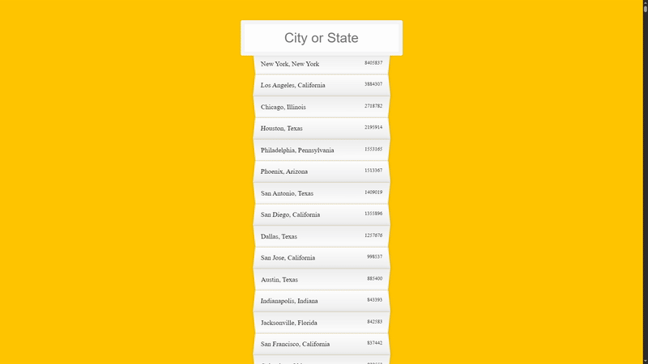
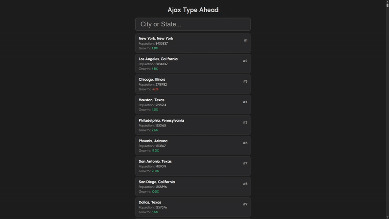

# Ajax Type Ahead – JS30 Challenge 6

This project is part of the **[JavaScript30 Challenge by Wes Bos](https://javascript30.com/)**, specifically **Challenge #6: Ajax Type Ahead**.

I approached this challenge in **two parts**:

1. **Tutorial Focus (Part 1)**

   * Followed the original tutorial closely to understand how data fetching, regex matching, and dynamic DOM updates work.
   * Practiced and broke down each concept for deeper understanding.

2. **Active Recall & Redesign (Part 2)**

   * Rebuilt the project from scratch without referring back to the tutorial, applying all concepts learned.
   * Enhanced the UI with:

     * **Improved card design** and **hover animations**.
     * Added **extra information** like city rank, population, and growth percentage.
     * **Color-coded growth indicators**:

       * 🟢 Positive growth
       * 🔴 Negative growth
       

---

## 🔑 Concepts Learned

Through this project, I strengthened my understanding of **core JavaScript features**:

1. **Array Destructuring & Data Push**

   ```js
   axios.get(endpoint)
     .then((res) => res.data)
     .then((data) => cities.push(...data));
   ```

2. **Dynamic Regular Expressions**

   ```js
   const regexp = new RegExp(wordToMatch, 'gi');
   return place.city.match(regexp) || place.state.match(regexp);
   ```

3. **String Replace for Highlighting Matches**

   ```js
   let cityName = place.city.replace(regexp, `<span class='hl'>${this.value}</span>`);
   ```

4. **Returning HTML Templates Dynamically**

   ```js
   return `
     <li>
       <div class="details">
         <h3 class="city-state">${cityName}, ${stateName}</h3>
         <p class="population">Population : <span>${population}</span></p>
         <p class="growth">Growth : <span class="${growthColor}">${growth}</span></p>
       </div>
       <div class="rank">
         <p>#${rank}</p>
       </div>
     </li>
   `;
   ```

5. **Using `.join('')` to Concatenate HTML Strings Without Commas**

   ```js
   const html = arrayToDisplay.map(place => {
     // return template string
   }).join('');
   ```

---

## 🛠️ Tech Stack

* **JavaScript (ES6+)**
* **HTML5**
* **CSS3 (custom animations & hover effects)**
* **Axios** for data fetching

---
## 📚 Reflection

This challenge taught me how **regular expressions, string methods, and dynamic DOM manipulation** can work together to build an interactive search feature.

Rebuilding the project from scratch (Part 2) helped me **actively recall concepts**, improve my **design sense**, and build confidence in applying JavaScript logic independently.
