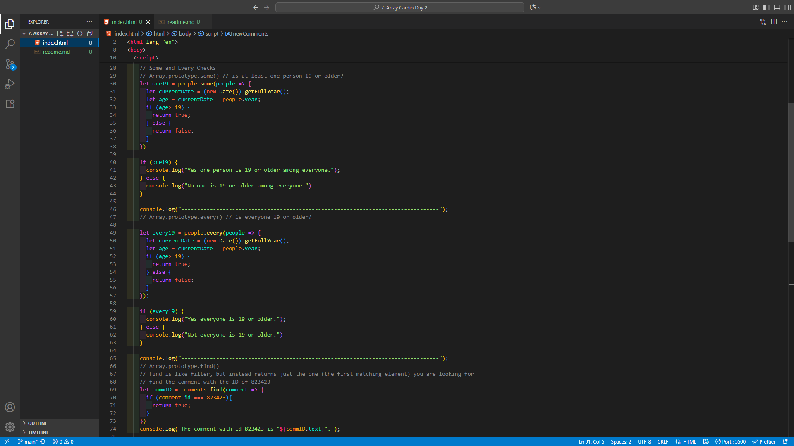

# Array Cardio Day 2 – JS30 Challenge 7

This project is part of the **[JavaScript30 Challenge by Wes Bos](https://javascript30.com/)**, specifically **Challenge #7: Array Cardio Day 2**.

The focus of this challenge was to dive deeper into **JavaScript Array methods** and understand how they behave in real scenarios.

---

## 🔑 Concepts Learned

1. **`some()`** – checks if **at least one element** in the array passes the test.
2. **`every()`** – checks if **all elements** pass the test.
3. **`find()`** – returns the **first element** that matches the condition.
4. **`findIndex()`** – returns the **index of the first matching element**.

---

## 🧩 Mistakes & Fixes

### 1. Returning Wrong Values in `some()` and `every()`

* ❌ Mistake: Trying to return other values instead of `true`/`false`.
* ✅ Fix: Remembered that both methods expect **boolean return values** inside their callbacks.

---

### 2. Misusing `splice()` Instead of `slice()`

While removing an element from an array:

❌ Wrong (using `splice`, which mutates the original array):

```js
let newComments = [
  ...comments.splice(0, findIDindex), 
  ...comments.splice(findIDindex + 1)
];
console.table(newComments);
```

✅ Correct (using `slice`, which does not mutate the original array):

```js
let newComments = [
  ...comments.slice(0, findIDindex), 
  ...comments.slice(findIDindex + 1)
];
console.table(newComments);
```

Key takeaway:

* **`splice()`** → changes the original array.
* **`slice()`** → returns a new array without modifying the original.

---

## 📚 Reflection

This challenge helped me:

* Get comfortable with **boolean-returning methods** (`some`, `every`).
* Practice **searching arrays efficiently** (`find`, `findIndex`).
* Understand the crucial difference between **`slice` (non-mutating)** and **`splice` (mutating)** when working with arrays.

It reinforced that **small mistakes in array methods can change outcomes drastically**, so understanding mutability is key.