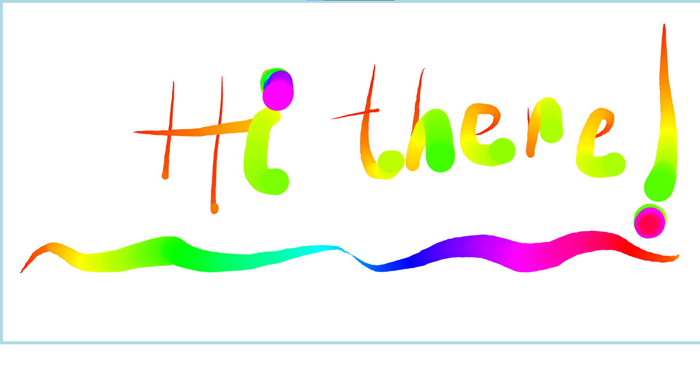
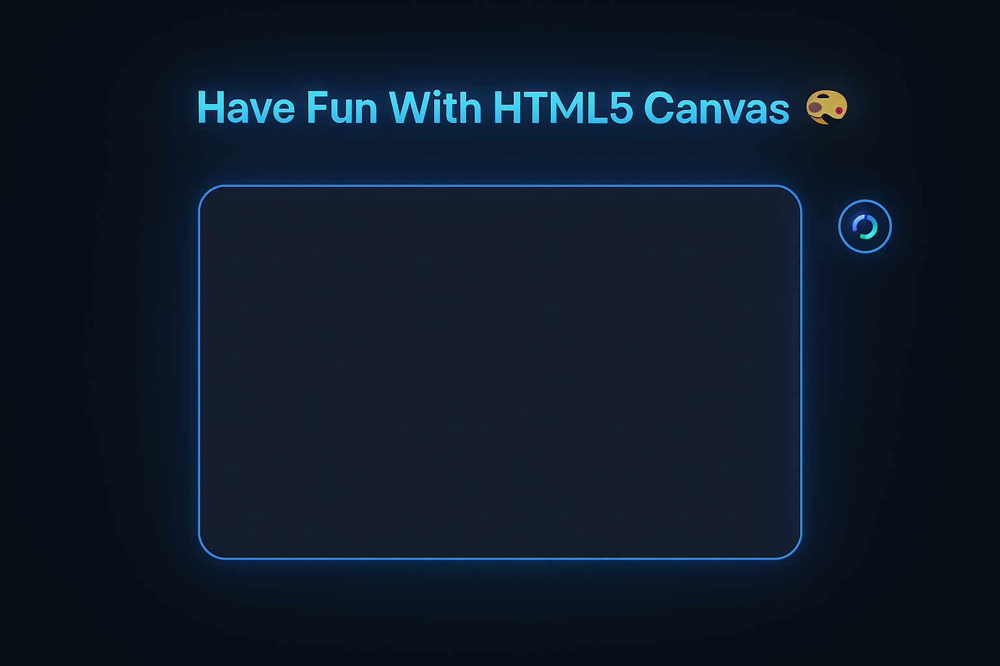

# Fun with HTML5 Canvas – JS30 Challenge 8

This project is part of the **[JavaScript30 Challenge by Wes Bos](https://javascript30.com/)**, specifically **Challenge #8: Fun with HTML5 Canvas**.

In this challenge, I was introduced to the **HTML5 `<canvas>` element** and its **drawing API**, exploring how to render dynamic visuals with JavaScript.

---

## 🎨 Project Overview

I approached this challenge in **two stages**:

1. **Tutorial Understanding (Stage 1)**

   - Followed the original Wes Bos tutorial step by step.
   - Focused on grasping the fundamentals of the Canvas API, event listeners, and how the drawing logic works.
     

2. **Independent Implementation & Redesign (Stage 2)**

   - Rebuilt the project entirely from scratch to test my understanding of the concepts (active recall).
   - Improved the **visual design** to make drawing feel smoother and more appealing.
   - Added a **Reset Button** 🧹 that clears the canvas when it gets too cluttered — no need to refresh the page anymore!
     

---

## 🧠 Key Concepts & Learnings

### 1. Setting Canvas Dimensions Correctly

Learned that **canvas width and height must be set explicitly** using HTML or JavaScript, not CSS.
Otherwise, the drawing coordinates and cursor alignment won’t match.

**Match CSS width/height:**

```js
canvas.width = canvas.offsetWidth;
canvas.height = canvas.offsetHeight;
```

**Make the canvas fill the browser window:**

```js
canvas.width = window.innerWidth;
canvas.height = window.innerHeight;
```

---

### 2. Drawing on the Canvas

Used the `getContext("2d")` method to get the drawing tools and configured brush properties:

```js
const ctx = canvas.getContext("2d");

ctx.beginPath();
ctx.strokeStyle = `hsl(${hue}, 100%, 50%)`;
ctx.lineJoin = "round";
ctx.lineCap = "round";

ctx.moveTo(lastX, lastY);
ctx.lineTo(e.offsetX, e.offsetY);
ctx.stroke();
```

---

### 3. Clearing the Canvas

Used the `clearRect()` method to clear the canvas.
Also bound it to a **Reset Button** for convenience:

```js
function clearCanvas() {
  ctx.clearRect(0, 0, canvas.width, canvas.height);
}
```

---

### 4. Dynamic Line Width Logic

This was the trickiest part to understand — how the **line width oscillates** between growing and shrinking while drawing.

**Final logic:**

```js
if (ctx.lineWidth >= 100 || ctx.lineWidth <= 1) {
  change = !change; // Flip direction when limit is reached
}

if (change) {
  ctx.lineWidth--;
} else {
  ctx.lineWidth++;
}
```

This creates a beautiful **breathing brush effect**, where the stroke thickness changes as you move your cursor.
