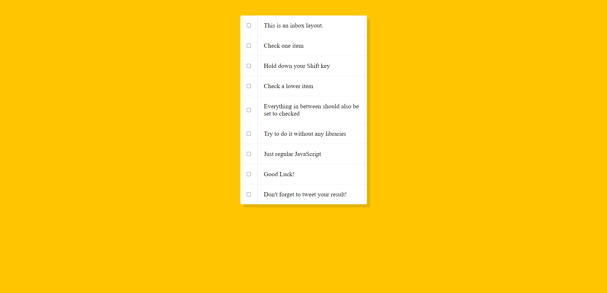
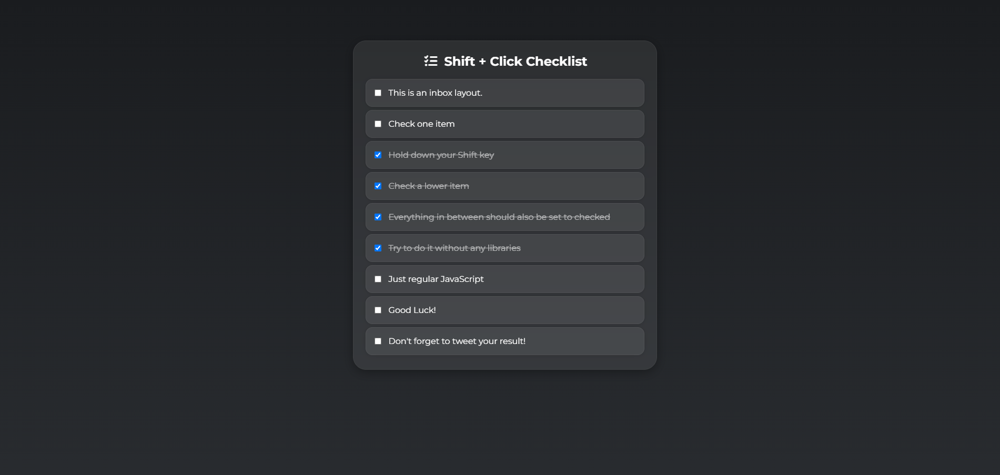

# Hold Shift to Check Multiple Checkboxes – JS30 Challenge 10

This project is part of the **[JavaScript30 Challenge by Wes Bos](https://javascript30.com/)**, specifically **Challenge #10: Hold Shift to Check Multiple Checkboxes**.

The goal of this challenge was to recreate the **multi-select checkbox behavior** found in applications like Gmail — where you can hold **Shift** and select multiple checkboxes at once — using only plain JavaScript (no frameworks or libraries).

---

## 🧠 What I Learned

This challenge focused on **event handling**, **keyboard modifiers**, and **state tracking**.

I learned:

- How to listen for user keyboard actions (like the **Shift key**).
- How to track the **last checked** checkbox.
- How to use a **flag variable** to mark when we’re “in-between” two checkboxes.
- Why the order of statements (especially `lastChecked = this;`) matters.

---

## 💡 Core Logic Explained

Here’s the main function that makes it all work:

```js
function handleCheck(e) {
  // Run only if the shift key is pressed AND the current checkbox is being checked
  if (e.shiftKey && this.checked) {
    let inBetween = false; // Acts as a flag to mark "start" and "end" of the selection

    checkboxes.forEach((checkbox) => {
      // Flip the flag when we reach either the current checkbox OR the last checked one
      if (checkbox === this || checkbox === lastChecked) {
        inBetween = !inBetween;
      }

      // While the flag is true, check all the boxes in between
      if (inBetween) {
        checkbox.checked = true;
      }
    });
  }

  // Store the current checkbox as the last checked one
  lastChecked = this;
}
```

---

## 🔍 Step-by-Step Breakdown

1. **Detect Shift Key Press**
   The function first checks if the user is holding down **Shift** while clicking a checkbox (`e.shiftKey`).

2. **Track the Last Checked Checkbox**
   To know the _range_ of boxes to select, we store the _previously checked box_ in a variable called `lastChecked`.

3. **Use a Flag (`inBetween`)**
   A boolean flag is used to mark the section “in between” the last checked and the current checkbox.

   - When the loop encounters either of the two checkboxes, the flag flips (`true` → `false` or `false` → `true`).
   - While `inBetween` is `true`, all checkboxes are checked.

4. **Update `lastChecked`**
   This must come **at the end** — otherwise, the code would lose track of which checkbox was previously selected.

---

## ⚙️ Implementation Flow

1. Select all checkboxes using `document.querySelectorAll()`.
2. Add an event listener to each checkbox for the `"click"` event.
3. When a checkbox is clicked, run `handleCheck(e)` which:

   - Checks for `shiftKey`.
   - Toggles the `inBetween` flag.
   - Updates the state of checkboxes accordingly.

---

## 🎨 Project Versions

### 🧩 Part 1 – Core Logic Focus

- Used the **default Wes Bos design**.
- Focused mainly on **understanding the concept and flow**.
- Debugged issues like:

  - Why the flag (`inBetween`) is necessary.
  - Why `lastChecked` must be declared and updated last.
    

### 💎 Part 2 – Custom UI Focus

- Implemented the same logic **from scratch** to reinforce learning.
- Created a **modern, sleek design** with:

  - Soft colors and subtle hover effects.
  - Rounded checkboxes.
  - Smooth check/uncheck animations.

- This helped me understand not just _how_ the logic works, but _why_ each step is necessary.


