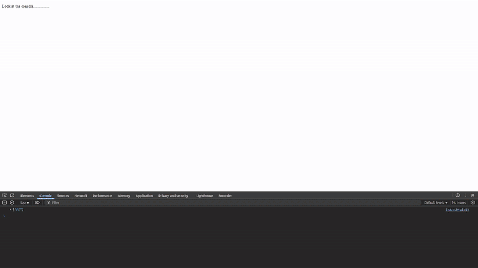

# 🧩 JS30 Challenge 12 — Key Sequence Detection (My Attempt)

## 📘 Overview

In this challenge, the goal was to detect a **specific sequence of keys** typed by the user and trigger a fun animation or event (in this case, `cornify_add()` 🦄) when the sequence matches.
The tutorial used the sequence `"wesbos"`, but I created my own — `"rico"` — just to make it more personal and shorter for testing.

This project helped me understand how to:

- Capture and handle **keyboard events** in real-time.
- Maintain a **rolling array of pressed keys**.
- Compare sequences using **string operations**.
  

---

## 🧠 What I Learnt

### 1. Handling Keyboard Inputs

Used `window.addEventListener("keyup")` to detect each key press:

```js
window.addEventListener("keyup", (e) => {
  let pressedKey = e.key;
  pressed.push(pressedKey);
});
```

Each key pressed is stored in an array named `pressed`.

---

### 2. Trimming the Array Length Dynamically

I initially got confused with how Wes Bos limited the array length using:

```js
pressed.splice(-secretCode.length - 1, pressed.length - secretCode.length);
```

This was a bit hard to intuitively understand, so I implemented a **simpler and more readable** version:

```js
if (pressed.length > secretCode.length) {
  pressed.shift(); // removes the first element, keeping the latest keys only
}
```

This ensures the array never grows beyond the length of the secret code.

---

### 3. Checking for the Secret Code

Once the array is properly trimmed, I joined it into a string and checked if it includes the secret sequence:

```js
let joinedString = pressed.join("");

if (joinedString.includes(secretCode)) {
  console.log("You cornified");
  cornify_add();
}
```

The `includes()` method makes this very readable and easy to debug.

---

### 4. Understanding My Confusion Point

My main confusion was with the `splice()` method used in the tutorial.
I tried:

```js
pressed.splice(0, pressed.length - secretCode.length);
```

and also Wes’s version:

```js
pressed.splice(-secretCode.length - 1, pressed.length - secretCode.length);
```

But both looked less intuitive, so I replaced it with the `if...shift()` approach since it achieves the same thing more clearly.

---

## 💡 Key Takeaways

- Learnt how to capture and process **keyboard input streams**.
- Understood how to **maintain a sliding window** of user input.
- Got more comfortable using **array trimming and string comparison techniques**.
- Reinforced the idea that **readability > cleverness** when writing code for learning purposes.
