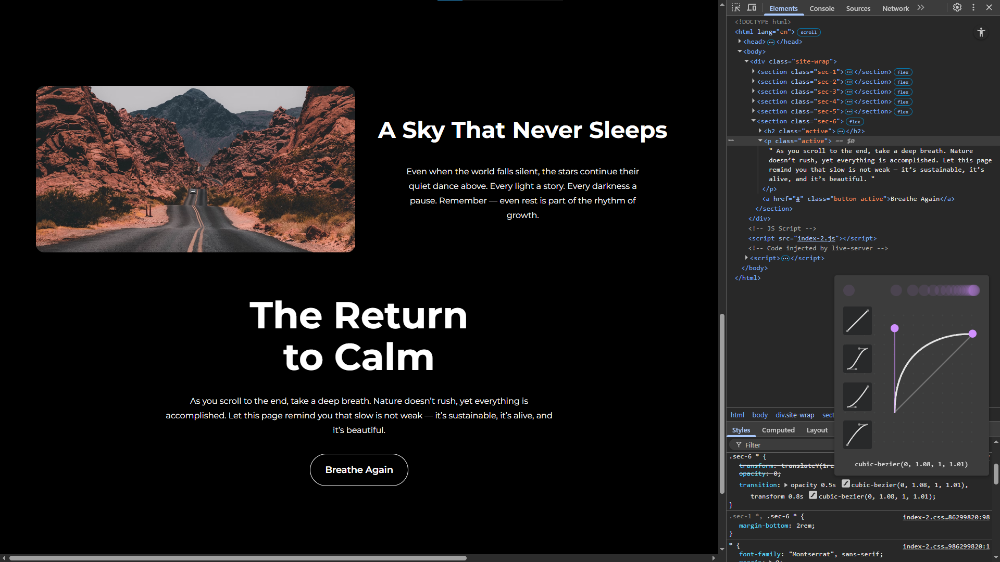

# 🌄 Slide In on Scroll– JS30 Challenge #13

## 📘 Overview

This challenge taught me how to trigger animations as elements scroll into view — a very common effect in modern web design. The main focus was understanding how to **detect when an image is halfway visible in the viewport** and then **animate it in smoothly**.

At first, it looked simple, but understanding the math behind the visibility detection and the need for a **debounce function** took some trial and error.


---

## 🧠 What I Learnt

### 1. The Debounce Function

One of the key things I learnt in this project was the **debounce function** — used to limit how often a function executes during high-frequency events like scrolling.

```js
function debounce(func, wait = 20, immediate = true) {
  var timeout;
  return function () {
    var context = this,
      args = arguments;
    var later = function () {
      timeout = null;
      if (!immediate) func.apply(context, args);
    };
    var callNow = immediate && !timeout;
    clearTimeout(timeout);
    timeout = setTimeout(later, wait);
    if (callNow) func.apply(context, args);
  };
}

window.addEventListener("scroll", debounce(checkSlide));
```

**Why it’s used:**
The scroll event fires _many times per second_, which can hurt performance if every scroll position triggers heavy calculations.
Debouncing ensures the `checkSlide()` function runs only once every few milliseconds — balancing **smoothness** and **performance**.

---

### 2. Detecting When an Image Slides In

This part was the most confusing initially. The math felt complicated at first, but after breaking it down, I finally understood it.

```js
function checkSlide(e) {
  sliderImages.forEach((sliderImage) => {
    const slideInAt =
      window.scrollY + window.innerHeight - sliderImage.offsetHeight / 2;
    const imageBottomEdge = sliderImage.offsetTop + sliderImage.offsetHeight;

    const isHalfShown = slideInAt > sliderImage.offsetTop;
    const isNotScrolledPast = window.scrollY < imageBottomEdge;

    if (isHalfShown && isNotScrolledPast) {
      sliderImage.classList.add("active");
    } else {
      sliderImage.classList.remove("active");
    }
  });
}
```

**Logic breakdown:**

- `slideInAt` → where the bottom of the viewport is (considering halfway into the image).
- `imageBottomEdge` → the pixel position of the image’s bottom edge.
- `isHalfShown` → checks if the image is halfway visible.
- `isNotScrolledPast` → ensures the image hasn’t been completely scrolled past.

If both are true, the image becomes active and animates in.

---

### 3. The Height Property Issue

I initially used `.height` to calculate dimensions, but it caused inconsistent results since it depends on the image being fully loaded.

Replaced it with:

```js
sliderImage.offsetHeight;
```

which works reliably across browsers and doesn’t depend on image load timing.

---

### 4. UI Improvements & Fine-Tuning

In my second attempt, I:




- Added **extra animations** and made the UI more visually appealing.
- Tweaked the debounce delay from `20ms` to `10ms` to improve responsiveness — since otherwise, the animations felt a bit delayed and lost precision.

This made scrolling feel smoother and more fluid while keeping performance balanced.

---

## 💡 Key Takeaways

- Understood the **importance of performance optimization** during scroll-heavy events.
- Learnt how to **detect element visibility** dynamically using `scrollY`, `innerHeight`, and offset properties.
- Realized how **small timing changes** (like debounce delay) can impact the overall animation feel.
- Improved debugging instincts — especially around **DOM properties** like `.offsetHeight` vs `.height`.
