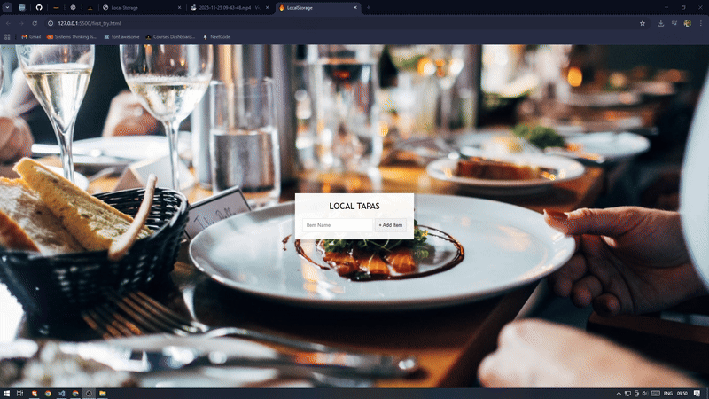
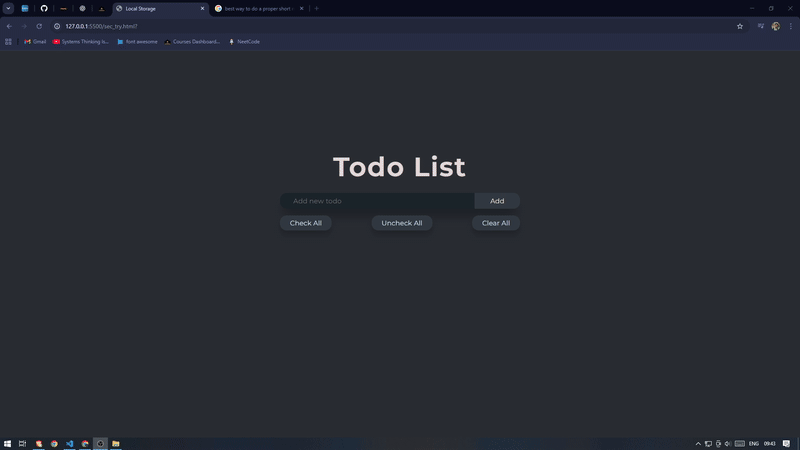

# **JS30 – Challenge 15: LocalStorage + Event Delegation (My Breakdown)**

## **Phase 1 — Understanding the Concepts**



In the first pass, I mainly focused on clarifying the underlying concepts used in this challenge. Most were already familiar from earlier projects, but a few new things stood out:

### **1. Resetting Forms**

- Learned the `.reset()` method on form elements.
- Straightforward: instantly clears all form input values.

### **2. Local Storage (Core Learning of This Challenge)**

What I learned beyond the tutorial:

- LocalStorage is **not sent to the server** like cookies.
- Data persists across **page reloads** and **full browser restarts**.
- Only **strings** can be stored → requires:

  - `JSON.stringify()` before saving
  - `JSON.parse()` when retrieving

Key methods I used:

- `localStorage.setItem(key, value)`
- `localStorage.getItem(key)`
- `localStorage.removeItem(key)`
- `localStorage.clear()`

Important rules I discovered:

- Don’t store raw arrays/objects → convert.
- Expect `null` from `.getItem()` when nothing exists.
- LocalStorage values don’t magically update your UI — you must re-render manually.

### **3. Event Delegation**

Instead of adding event listeners to every checkbox, I used a single listener on the parent list and accessed the actual clicked element via `event.target`.

Why it matters:

- Cleaner.
- Scalable.
- Faster than attaching dozens of listeners.

I now understand delegation as:

> “Attach one listener high up, react to events lower down.”

---

## **Phase 2 — Implementing Everything + Extra Features**

In the second pass I focused on:

- Writing everything myself
- Improving UI/UX
- Extending functionality beyond the tutorial



### **Added Features**

I built three extra buttons:

- **Check All**
- **Uncheck All**
- **Clear All**

All three are fully synced with LocalStorage (this forced me to understand storage updates properly).

### **Challenges I Hit**

#### **1. Understanding `this.querySelector("input[type=text]")`**

At first it felt odd, but I realized:

- In a form submit handler, `this` refers to the **form element**.
- So `this.querySelector("input[type=text]")` safely grabs the text field inside the form.
- `value.trim()` ensures I don't store empty whitespace.

#### **2. Remembering to `stringify` before saving**

My initial mistake:

```js
localStorage.setItem("allTasks", tasks);
```

This obviously fails because LocalStorage can't store objects/arrays directly.

Correct approach:

```js
localStorage.setItem("allTasks", JSON.stringify(tasks));
```

And retrieving them:

```js
JSON.parse(localStorage.getItem("allTasks"));
```

This challenge finally forced me to internalize stringification/parsing as a **mandatory workflow** for persistent JS data.
